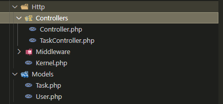
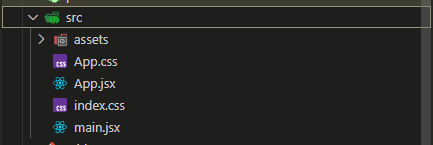

Sistema de Gerenciamento de Tarefas

Sistema simples para gerenciar tarefas com:
- Backend em "PHP Laravel 9"
- Frontend em "React + Vite"
- Banco de dados "MySQL"
- API "RESTful" e interface web responsiva

Funcionalidades DO PROJETO:

- cadastar nova tarefas 
- Listar todas as tarefas
- Visualizar detalher de uma tarefa 
- Atualizar uma tarefa 
- Marcar como concluida 
- Excluir tarefas 

Tecnologias Utilizadas:
 
* Backend - PHP, Laravel 9 
* Bacno - MYSQL
* Frontend - React, Vite, CSS
* API - JSON RESTful

Como Executar o Projeto:

*  Clonar o repositório,
BASH
- git clone (https://github.com/devanzir/gerenciador-de-tarefas/edit/main)
- cd gerenciador-de-tarefas

Configurar o Backend (LARAVEL):

- cd tasks-api
- composer install 

Criar arquivo .env e gerar chave:

- cp .env.example.env
php artisan key:generate 

Configurar banco de dados no .env:

DB_CONNECTION=mysql
DB_HOST=127.0.0.1
DB_PORT=3306
DB_DATABASE=tasks_db
DB_USERNAME=seu_usuario
DB_PASSWORD=sua_senha

- php artisan migrate.
- php artisan serve.
- http://localhost:8000/api/tasks

Configurar o Frontend (React):

- cd tasks-api/frontend
- npm install
- npm rum dev 
- http://localhost:5173.

Observações Técnicas:

* Versão do Laravel : Foi utilizada a versão 9.x, compatível com PHP 8.0.

* CORS : O pacote fruitcake/laravel-cors foi instalado para permitir requi* sições do frontend React.

* ouve umas correçoes e inclusões por conta do PHP8.1+ Se estiver usando PHP 8.1 ou superior, aviso que pode gerasr algum erro. Para avitar isso, foi incluido a seguinte linha:

 > - error_reporting(E_ALL ^ E_DEPRECATED); <

dentro do aquivo **bootstrap/app.php.**.

* API Fetch: O frontend consome a API utilizando fetch, sem bibliotecas externas.
* Estilo : Estilização simples com CSS puro para facilitar a manutenção.

Testes:

* Postman — para testar os endpoints da API.

PROJETO:

BACKEND:

FRONTEND:

